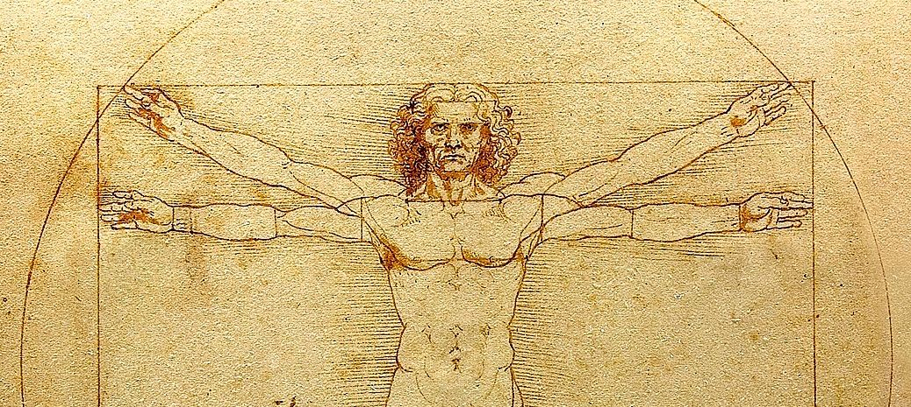
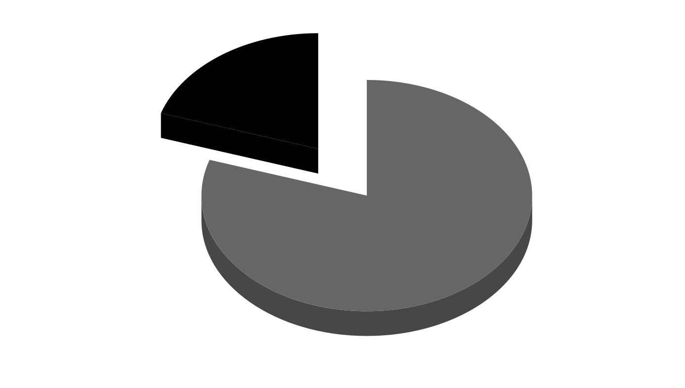

## Založenie blogu

Tento blog som vytvoril, aby slúžil ako návod na dosiahnutie optimálnych výsledkov pri rôznych
každodenných rozhodnutiach, ako napríklad výber techniky do domácnosti, vhodných nástrojov na
vykonávanie svojich koníčkov/záľub a investovaním svojich peňazí a času do správnych vecí.
Všetky moje odporúčania budú odzrkadlovať moje vlastné potreby, ale vždy na základe objektívnych
dôvodov.  

Poďme sa pozrieť na pojmy na ktorých bude založená filozofia tohto blogu.

### Minmax

Pojem "_minmax_" znamená využiť svoje silné stránky v maximálnej možnej miere a zminimalizovať slabosti. Pôvodne používaný pri vytváraní a optimalizovaní postáv v rôznych počítačových a stolových hrách, kde sa hráči zamerali na vytvorenie a vybudovanie takej postavy, ktorá má zanedbateľné množstvo slabých stránok/vlastností na daný úkol (napr. porazenie silného nepriateľa) a čo najviac silných stránok pre optimálny výkon v danej situácii.

Ako jednoduchý príklad z hier spomeniem lukostrelca: 

* Max
  * kvalitný luk a šípy
  * ľahké brnenie a vysokú obratnosť pre rýchly presun a manévrovanie na bojisku
  * vysokú presnosť aby trafil vzdialené ciele  

* Min
  * hrubá sila a zručnosť so štítom (nepotrebuje bojovať nablízko)
  * celotelové brnenie  (z rovnakého dôvodu)

### Paretov princíp (alebo pravidlo 80/20)

Základná forma tohto princípu spočíva v tom, že 80% problémov pramení z 20% príčin. Ako príklad spomeniem výrobu produktov, elimináciou dvoch najväčších problémov z desiatich dosiahneme zlepšenie výroby o 80%.  

Tento princíp sa dá aplikovať viacerými spôsobmi:
* **Manažovanie času**  
  prioritne sa venujem 20% úlohám ktoré prinesú 80% celkového výsledku, takto viem rozdeliť projekty na menšie časti. Po ukončení prvých 20% úloh zvyšok znovu rozdelím na základe tohto pravidla
* **Práca pre klientov**  
  ak 20% klientov tvorí 80% môjho zisku, venujem sa najmä týmto klientom
* **Fotografovanie**  
  pri triedení fotiek z dovolenky som zistil že 80% fotiek som fotil so širokouhlým objektívom, alebo dokonca by som niekedy chcel ešte širší záber, takto zistím že moja ďalšia investícia bude do širokouhlého objektívu a nie portrétového
* **Výbava domácnosti**  
  ak 80% voľného času trávim pri počítači alebo televízore, investujem 20% svojho rozpočtu pre technické vybavenie domácnosti do týchto dvoch zariadení
   

Snažím sa tento princíp alebo jeho formu aplikovať aj ja, hlavne pri výbere zariadení ako telefón, kde vieme dostať 80% vlastností najvyššej rady telefónov za 20% ceny, ale ak nechceme ísť do extrémov, viem to prispôsobiť na dosiahnutie napr. 90% vlastností za 40% ceny.

### Ovládanie emócií

Väčšina z nás je ľahko ovplyvniteľná reklamou, médiami, ale aj kamarátmi, spolužiakmi alebo kolegami. Mojim cieľom je odolávať týmto pokušeniam a to tak, že sa snažím sám sebe argumentovať o potrebe kúpy napríklad novej techniky  po položení otázok typu:
* **Kúpiť najnovší telefón?**  
  starý telefón mi doteraz fungoval bez problémov, využívam ho na komunikáciu, predpoveď počasia a sledovanie vtipných videí. Od telefónu očakávam, aby vydržal jeden deň používania, a to zatiaľ spĺňa aj súčasný. Čo mi vie ponúknuť nový telefón? Chýba mi niečo?
* **Fotoaparát Canikon má 4x väčší senzor ako môj súčasný, oplatí sa mi ho kúpiť?**  
  väčší senzor znamená väčšie náklady na objektívy, ktoré majú väčšiu hmotnosť a moje súčasné nebudú kompatibilné s novým telom. Oplatí sa mi investovať čas a peniaze do nového systému ak som so súčasnou kvalitou fotiek spokojný?
* **Nové alebo ojazdené auto?**  
  Nové autá strácajú až 30% svojej hodnoty už po prvých 3 rokoch používania. Vidím praktické dôvody prečo ísť do nového auta? Možno prebieha dotácia od štátu pre nové vozidlá, alebo trh s použitými vozidlami prežíva infláciu (aktuálny stav v čase písania článku)

A práve toto bude cieľom tohto blogu, ukázať vám ako vieme dosiahnuť pre nás optimálne výsledky v rôznych oblastiach života. Venovať sa budem výbave domácnosti so zameraním na techniku, rôznym koníčkom (fotografovanie, počítače, domáca sieť), ale v budúcnosti môžete očakávať aj články zamerané na financie a finančnú gramotnosť.

